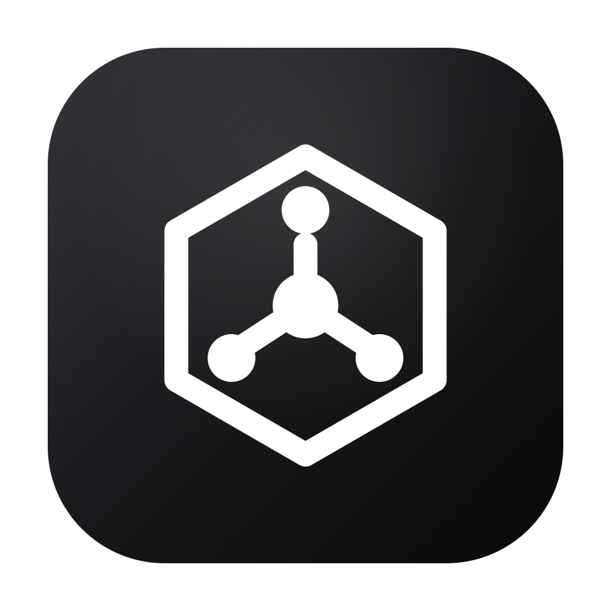
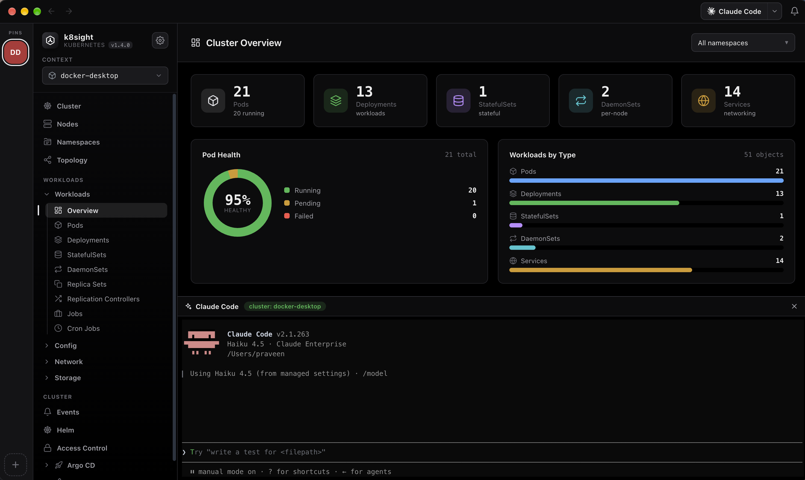

<div align="center">



# k8sight

**See your whole cluster in one beautiful window.**

A native desktop app (macOS · Windows · Linux) — and a Docker image — for browsing and operating any Kubernetes cluster from your local `kubeconfig`.

[](https://github.com/praveenraghav01/k8sight/actions/workflows/ci.yml)
[](https://github.com/praveenraghav01/k8sight/actions/workflows/release.yml)
[](https://github.com/praveenraghav01/k8sight/releases/latest)
[](https://github.com/praveenraghav01/k8sight/releases)
[](LICENSE)


</div>



> [!TIP]
> Grab the latest macOS `.dmg`, Windows `.exe`, or Linux `.AppImage`/`.deb` from the [**Releases**](https://github.com/praveenraghav01/k8sight/releases/latest) page — no build required.

## Features

**Demo mode — try it with no cluster**
- Pick the built-in **demo cluster** (or click **Explore the demo** on the connect screen) to try every feature against a realistic synthetic cluster — sample workloads (including a Pending and a CrashLoopBackOff pod), live metrics, logs, topology, Helm, Argo CD, a Security Center scan, a pod shell and the AI assistant — with **no kubeconfig required**.

**Explore**
- Live cluster dashboard — node/pod health, workload charts, capacity.
- Every workload type (Pods, Deployments, StatefulSets, DaemonSets, Services, …) with live CPU/memory, per-container status, and cross-links (namespace → node → pod → owner).
- Interactive pan/zoom topology graph, lazy-loaded Custom Resource tree, and Helm releases with values and rendered manifests.
- Command palette (⌘K), native title bar with back/forward history, light & dark themes.

**Operate**
- Edit and apply YAML; per-row Scale, Rollout restart, and Delete (two-step confirm).
- Pro log viewer — timestamps, per-container or merged streams, regex search, tail size, download.
- Interactive shell — a real TTY into pods (`kubectl exec -it` over WebSocket).
- Port-forward a Service to `localhost`, and a multi-tab bottom panel for logs/terminal/YAML.

**Cloud clusters, no CLI**
- One-click **AWS EKS** (SSO, access keys, or assume-role) and **Azure AKS** (system browser or `az`) — discover clusters across accounts/subscriptions and merge them into your kubeconfig. Bundled token helpers authenticate at runtime, so *using* imported clusters needs no `aws`/`az`/`kubelogin`.
- GKE, on-prem, kind/minikube and any other context work straight from your existing kubeconfig.

**Security Center**
- Scan running images for CVEs, audit configuration and RBAC risk, and find exposed secrets — reading **Trivy Operator** reports or a **bundled Trivy** binary, so you can scan with nothing installed in-cluster.

**Argo CD** (auto-detected)
- GitOps dashboard, resource-tree View, Applications/AppSets/Projects, and Sync/Refresh/Rollback actions.

**AI, bring your own**
- A read-only, tool-using assistant grounded in live cluster data — connect any OpenAI-compatible endpoint (secrets redacted before anything leaves the app).
- Docked coding agents — detects Claude Code, GitHub Copilot CLI, Gemini CLI, Codex and opencode on your `PATH`.
- Doubles as an [MCP](https://modelcontextprotocol.io) server so external agents can inspect the cluster ([details](#connect-ai-agents-mcp)).

## How k8sight compares

k8sight is a **desktop UI for clusters you already have** — closest in spirit to **Lens** and **k9s**, not to a management *platform* like **Rancher**. Rancher runs *inside* your clusters to provision and govern a whole fleet for a team; k8sight runs on your laptop, reads your kubeconfig, and needs nothing installed in-cluster.

| | **k8sight** | **Rancher** | **Lens / k9s** |
|---|:---:|:---:|:---:|
| Category | Native desktop UI | Multi-cluster platform (server) | Desktop UI / terminal UI |
| Setup | Download & run | Deploy & operate in-cluster | Download & run |
| Runs where | Your laptop | In a cluster | Your laptop / terminal |
| Cluster lifecycle (provision, upgrade) | — | ✅ | — |
| Centralized team RBAC & multi-tenancy | — | ✅ | — |
| Built-in security scan (image CVEs, config, RBAC) | ✅ *bundled Trivy* | via add-ons | — |
| AI assistant + MCP server | ✅ | — | — |
| Try with no cluster (demo mode) | ✅ | — | — |
| One-click EKS/AKS onboarding (no CLI) | ✅ | ✅ | — |
| Free & open-source | ✅ | ✅ | k9s ✅ · Lens: sign-in required |

> [!NOTE]
> Reach for **Rancher** to provision and govern a fleet of clusters for a team. Reach for **k8sight** as a fast local cockpit for clusters you already have — dashboards, logs, shell, topology, security scans and an AI assistant, with nothing to deploy. They coexist happily.

## Quick start

> [!TIP]
> No cluster handy? Launch the app and click **Explore the demo** (or pick the **demo** context) to browse and operate a synthetic cluster — every feature works, no setup needed.

> [!NOTE]
> To use a real cluster, k8sight needs `kubectl` on your `PATH` and a working `kubeconfig` (`~/.kube/config`, or set `KUBECONFIG`). The `helm` CLI is **not** required — Helm releases are read straight from the Kubernetes API. The packaged desktop app bundles its own Node runtime; building from source needs **Node.js 22+** (see `.nvmrc`).

### Desktop app

Most people just [download a build](https://github.com/praveenraghav01/k8sight/releases/latest). Every release ships a `SHA256SUMS.txt`, a CycloneDX SBOM and a signed [build-provenance attestation](https://docs.github.com/en/actions/security-for-github-actions/using-artifact-attestations) per installer (`gh attestation verify k8sight-macos.dmg --repo praveenraghav01/k8sight`).

To build it yourself:

```bash
npm ci --ignore-scripts && npm rebuild node-pty && npm ci --prefix client --ignore-scripts
node node_modules/electron/install.js     # Electron binary (skipped by --ignore-scripts)
npm run dist        # fetches trivy (pinned, checksum-verified), builds the UI, packages for this OS → release/
```

| OS | Artifact |
|----|----------|
| macOS | `k8sight-macos.dmg` (**Apple Silicon only** — Intel Macs are not supported) |
| Windows | `k8sight-windows.exe` (NSIS) |
| Linux | `k8sight-linux.AppImage` and `k8sight-linux.deb` |

> [!IMPORTANT]
> Builds are ad-hoc signed (no paid certificate), so the OS will warn on first launch. On macOS, right-click the app → **Open**. Alternatively `xattr -dr com.apple.quarantine "/Applications/k8sight.app"` removes the quarantine flag — understand that this tells Gatekeeper to skip its checks for that bundle, so only do it for a download whose `SHA256SUMS.txt` / attestation you have verified. On Windows, SmartScreen → **More info → Run anyway**.

### Docker

The image (`linux/amd64` + `linux/arm64`) bundles Node, `kubectl`, `kubelogin` and `trivy` — all pinned and checksum-verified at build time — and serves the UI + API on port `3001` as the unprivileged `node` user.

```bash
docker run --rm -p 127.0.0.1:8080:3001 \
  -v "$HOME/.kube:/home/node/.kube:ro" \
  ghcr.io/praveenraghav01/k8sight:latest
```

Every API call needs a **bearer token**. The container generates one at boot and prints the login URL — read it with `docker logs`:

```bash
docker logs <container> 2>&1 | grep '#token='
# open http://127.0.0.1:3001/#token=…   ← use your published port instead, e.g. http://localhost:8080/#token=…
```

Or choose the token yourself with `-e K8SIGHT_TOKEN=<your-secret>`. Tags: `latest`, `<major.minor>` (e.g. `1.5`) and `v<semver>` (e.g. `v1.5.1`).

> [!WARNING]
> Publish to `127.0.0.1` unless you mean to expose it. If the container is reached through another hostname (a reverse proxy), allow it with `-e ALLOWED_HOSTS=k8sight.internal` — other `Host` headers are refused with HTTP 421. See [Security](#security).

<details>
<summary>Docker notes (local clusters, OIDC)</summary>

- **Local clusters** (Docker Desktop / kind / minikube) listen on `127.0.0.1`, which inside a container points at the container itself. Add `--add-host=host.docker.internal:host-gateway` and set the context's `server:` to `https://host.docker.internal:<port>` with `insecure-skip-tls-verify: true` — or just use the desktop app for local clusters.
- **OIDC clusters** (`kubectl oidc-login`): the container can't open a browser, so log in on the host first (`kubectl get nodes`) to cache a token, then mount `~/.kube` **read-write** (drop `:ro`) so kubelogin can refresh it.
- Kubeconfigs created by `aws eks update-kubeconfig`, `az aks get-credentials`, or GKE reference their own exec plugins, so those CLIs must be on `PATH` inside the container.

</details>

### From source (development)

```bash
npm ci --ignore-scripts && npm rebuild node-pty && npm ci --prefix client --ignore-scripts
npm run dev         # UI on http://localhost:3000, API on :3001
```

The backend prints `open http://127.0.0.1:3001/#token=…` at start — open the Vite URL with that same `#token=…` fragment (the UI stores it in `sessionStorage`). For a single-port production run: `npm run build && npm start`, then open the printed URL. `./run.sh` wraps all of this (and never uses `sudo` or `curl | sh`).

## Usage

1. **⌘K** (Ctrl+K) — jump to any view, cluster, or action; the toolbar's back/forward arrows retrace your steps.
2. **Pick a context** — the searchable sidebar selector switches clusters; pin favourites to the left rail.
3. **Add a cloud cluster** — the **+** button → **AWS** or **Azure** discovers and merges clusters into your kubeconfig.
4. **Click a row** — opens the detail drawer (with live pod metric graphs); the **⋮** menu has Details, Logs, Terminal, Edit YAML.
5. **AI & agents** — launch from the toolbar; configure in **Preferences → AI / External Tools**.

## Connect AI agents (MCP)

The app is also an [MCP](https://modelcontextprotocol.io) server exposing the same capabilities as the UI — **~30 read tools** (contexts, resources, logs, events, topology, metrics, Helm, CRDs, Argo CD, …) plus **6 write tools** (`apply_yaml`, `delete_resource`, `scale_workload`, `rollout_restart`, `sync_argocd_app`, `refresh_argocd_app`).

> [!NOTE]
> Write tools are **off by default**. Enable them in **Preferences → MCP Server → Write access**, or start with `MCP_ALLOW_WRITE=1`. Reconnect the agent to pick up the new tool set.

`/mcp` requires the same bearer token as the API. The desktop app generates a fresh token per launch and prints it in its log; a `node server.js` / Docker run prints it at boot; the token file lives at `~/.config/k8sight/token`.

**HTTP** (recommended) — while the app runs, agents connect to `http://localhost:3001/mcp`:

```bash
claude mcp add --transport http k8sight http://localhost:3001/mcp \
  --header "Authorization: Bearer $(cat ~/.config/k8sight/token)"
```

**Stdio** — for agents launched by command; the app must be running. The bridge reads `MCP_API_TOKEN` (falling back to `K8SIGHT_TOKEN`, then `~/.config/k8sight/token`):

```jsonc
{
  "mcpServers": {
    "k8sight": {
      "command": "node",
      "args": ["/absolute/path/to/k8sight/mcp-stdio.js"],
      "env": { "MCP_API_BASE": "http://127.0.0.1:3001", "MCP_API_TOKEN": "<token>", "MCP_ALLOW_WRITE": "0" }
    }
  }
}
```

All tools act on the **currently selected context**. Run the bridge standalone with `npm run mcp`.

## Configuration

| Variable | Purpose | Default |
|----------|---------|---------|
| `K8SIGHT_TOKEN` | Bearer token required on `/api/*`, `/mcp` and `/ws/exec` | generated → `~/.config/k8sight/token` |
| `KUBECONFIG` | Path to kubeconfig | `~/.kube/config` |
| `PORT` | Port the backend listens on | `3001` |
| `HOST` | Interface the backend binds | `127.0.0.1` (Docker sets `0.0.0.0`) |
| `ALLOWED_HOSTS` | Extra `Host` header values accepted besides loopback (comma-separated, e.g. `k8sight.internal:8080`) | — |
| `ALLOWED_ORIGINS` | Extra browser origins allowed to call `/api` and `/mcp` (comma-separated) | — |
| `LLM_BASE_URL` | OpenAI-compatible endpoint for the AI assistant | — |
| `LLM_API_KEY` | API key for the assistant (also settable in Preferences → AI) | — |
| `LLM_MODEL` | Model the assistant requests | — |
| `MCP_ALLOW_WRITE` | Enable MCP write/destructive tools | `0` (read-only) |
| `MCP_API_BASE` | API base URL the stdio MCP bridge targets | `http://127.0.0.1:3001` |
| `MCP_API_TOKEN` | Token the stdio MCP bridge sends | `K8SIGHT_TOKEN` / token file |

App data (token, assistant config, scan cache) lives in `~/.config/k8sight`.

## Security

The API, `/mcp` and the `/ws/exec` shell carry your kubeconfig's full read/write access, so the backend is protected by a **bearer token** and locked to the local machine by default. Report vulnerabilities as described in [SECURITY.md](SECURITY.md).

- **Token auth on every request** — `Authorization: Bearer <token>` on `/api/*` and `/mcp`, `?token=` on the `/ws/exec` upgrade. Only `GET /healthz` and `GET /api/version` are public. The token comes from `K8SIGHT_TOKEN`, else `~/.config/k8sight/token` (auto-generated, mode `0600`). The server prints the login URL `http://127.0.0.1:3001/#token=<token>` at boot; the UI moves the token from the URL fragment into `sessionStorage`.
- **Desktop app** — generates a fresh random token per launch, starts the backend on a port it verified is free (never attaching to a process that already listens there), passes only an allow-listed environment to it, keeps the renderer sandboxed with navigation pinned to the backend origin, and ships with Electron fuses that disable `ELECTRON_RUN_AS_NODE`, `NODE_OPTIONS` and `--inspect`.
- **Loopback by default** — binds `127.0.0.1`; set `HOST=0.0.0.0` only to expose it deliberately (the Docker image does this so its published port works).
- **Host allowlist** — only `localhost`, `127.0.0.1`, `[::1]` (plus `ALLOWED_HOSTS`) are accepted as `Host`; anything else gets HTTP 421, which defeats DNS rebinding.
- **Same-origin only** — a page on another origin can't drive the API or the exec WebSocket. Non-browser MCP clients are unaffected but still need the token.
- **Hardened responses** — strict CSP on the UI, `X-Frame-Options: DENY`, `nosniff`, no `X-Powered-By`, rate limiting, request-size limits and input validation on every path segment that reaches `kubectl`.
- **When exposing it**, publish to loopback and/or put an authenticating proxy in front, add its hostname via `ALLOWED_HOSTS` and its origin via `ALLOWED_ORIGINS`, and keep the token secret (it is printed in the container log — restrict `docker logs` access accordingly).

## Architecture

- **Backend** (`server.js` + `lib/`) — Express + `@kubernetes/client-node`; REST API, a `/ws/exec` WebSocket for shells, short-TTL caches, and `kubectl` for the few things the API can't do (exec, port-forward). Helm releases are decoded from their release Secrets. In production it also serves the built UI.
- **Frontend** (`client/`) — React + Vite; same-origin `/api` + `/ws/exec`, xterm.js terminal, ⌘K palette, token-driven theming.
- **Cloud** (`aws-eks.js`, `azure-aks.js`, `eks-token.js`, `azure-token.js`) — CLI-free EKS/AKS discovery, kubeconfig merge, and native runtime auth via bundled token helpers.
- **Security** (`trivy-scan.js`) — reads Trivy Operator reports or runs a bundled Trivy binary.
- **Desktop** (`electron/`) — Electron shell that runs the backend as a utility process; `after-pack.cjs` applies Electron fuses and ad-hoc signs the macOS build. Released for all three OSes plus the GHCR image by the [`Build & Release`](.github/workflows/release.yml) workflow on a `v*.*.*` tag that matches `VERSION`.

## Troubleshooting

- **"Unauthorized" / blank UI after opening `http://localhost:3001`** — open the full login URL printed by the server (with `#token=…`), or paste the token when the UI asks for it.
- **HTTP 421 Misdirected request** — you reached the server through a hostname it doesn't know; add it to `ALLOWED_HOSTS`.
- **"No kubeconfig loaded"** — ensure `~/.kube/config` exists or set `KUBECONFIG`.
- **Metrics show `—`** — the cluster needs **metrics-server** installed.
- **Terminal won't open** — the target container needs a shell; distroless images won't work.
- **"All namespaces" is slow the first time** — it fetches every namespace (cached afterward); pick one for faster loads.

## Contributing

See [CONTRIBUTING.md](CONTRIBUTING.md). Changes are tracked in [CHANGELOG.md](CHANGELOG.md).
